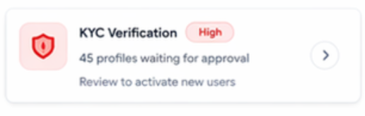

# Keen as Mustard Admin Dashboard: Detailed Analytics Documentation

## 📌 Overview

Is document mein hum **Keen as Mustard** ke naye Admin Dashboard design ko
samjhenge. Yeh dashboard ek **admin panel / analytics dashboard** hai jisme
platform ki overall activity, user behavior, revenue aur performance insights
dikhaye gaye hain. Iska purpose hai ki admin easily sab kuch ek jagah se monitor
kar sake.

## Main Thing: 
- Based on Date Range data get hoga. Default me last 30 days ka data get hoga.   

---

## 1. Zone A: Top Section (Today at a Glance)

Yeh section dashboard ka sabse "intelligent" hissa hai.

**Hinglish Explination:** Admin jaise hi login karta hai, usey yeh **5 KPI
cards** dikhte hain jo platform ka "Health Checkup" karte hain:

- **Revenue (+12%):** Pichle din ke comparison mein humne kitna paisa kamaya.
- **Boosts Driving (61%):** Platform ka main revenue source (Profile Boosts)
  kaisa perform kar raha hai.
- **Female Signups (-5%):** Growth alert! Agar female signups kam ho rahe hain
  toh platform balance ke liye campaign ki zarurat hai.
- **KYC pending** → 45 users approval ka wait kar rahe hain
- **Users flagged** → 12 users suspicious activity ke liye mark hue hain

👉 Right side me ek **small graph** hai jo weekly growth show karta hai (+12%)

---

## 2. Zone B: Ecosystem Alerts Section (Needs your attention)

Yeh zone critical tasks ko highlight karta hai taaki kuch miss na ho.

**Hinglish Explination:** Isme teen main alert cards hain jo "Severity" (High,
Medium, Info) ke basis pe categorized hain:

- **KYC Verification (Red/High):** Agar 45 profiles line mein hain, toh platform
  unsafe ho sakta hai. Yeh top priority hai. → 45 profiles approval ka wait kar rahe hain
- **High Reported Users (Medium):** Spammers ko track karne ke liye.
  "Investigate and take action" ka direct link hai.  → 12 users ko 5+ baar report kiya gaya
- **Ghosting Rate (Info):** Agar log matches ke baad silent ho rahe hain, toh
  yeh behavioral issue yahan dikhega. 
  → -10% (last 7 days me improvement)

**Visuals:**



👉 Admin ko yahan se quick action lena hota hai

---

## 3. Zone C: Key Metrics (Health Overview)

Platform ki internal performance monitor karne ke liye quick stats.

**Hinglish Explination:**

- **Match Liquidity (1.5%):** Swipes ke mukable kitne actual matche ho rahe
  hain. → 1.5% (matches per swipes)
- **Gender Ratio (63:37):** Platform par male:female balance kaisa hai. Isme ek
  progress-bar design hai visualization ke liye. → 63 : 37 (Male : Female)
- **Revenue Today (₹84k):** Direct cash calculation (Boosts: 61% vs Subs: 39%). → ₹84k
- **Funnel Drop-off (31%):** Registration ke waqt "Churn" kitna hai. → 31% (users drop ho rahe hain profile completion par)

---


## 4. Zone D: Core Analytics (Charts Row)

Visually understanding the trends.

**Hinglish Explination:** Isme teen main components hain:

- **User Growth by Gender:** Bar chart humein pichle 7 dino ka daily signup
  trend dikhata hai. Yahan "Male signups are up 18%" ka message trend highlight
  kar raha hai.
* Weekly signup data (Male vs Female)
* Trend clearly visible hai (growth stable hai)

- **💰 Revenue Breakdown (Donut Chart):** Total ₹84k ka division dikhata hai ki
  source kya hai.
* **Total** → ₹84k
* **Subscriptions** → 39%
* **Profile boosts & Superkeens** → 61% : → Profile boosts & Superkeens ko bhi seperate krke display krna hai 

- **Live Activity Feed:** Real-time ticker jo batata hai - "Abhi kisne Boost
  khareeda?" ya "Kaun match hua?".

---

### ⚡ Live Activity

Real-time events:

* Users matching
* Subscriptions purchase
* Reports & actions
* ---etc.

---

## 5. Zone E: Behavioral Funnels & Insights

Sabse tough aur important part yahi hai.

**Hinglish Explination:**

- **Conversion Funnel (Pyramid):** Installs (10k) se Subscription (1.2k) tak ka
  safar. Sabse bada drop 
- **Signups:**  abhi tak itne Signups hue hn → 8.2K

- **"Profile Completion"** par hai (-29%). Yeh batata hai
  ki profile setup process boring hai ya lamba.

## 🔹 6. Peak Activity Heatmap:
* Monday to Sunday ka "Heatmap" grid. Sabse dark green cells peak time (7 PM - 10 PM) ko dikhate hain.
* Users kab active hote hain (day & time wise)
* Peak time: **7PM – 10PM**
* Best day: **Friday**
---

## 🔹 7. Performance Insights: 
* ROI aur match rates ke progress bars. Yahan se recommendation milti hai, jaise: "4+ photo users drive the best results.

Key insights:

* Boost ROI → 4.5x
* Super Keen rate → 45%
* Normal match rate → 3%
* 4+ photo users → better matches
* Deep connections → 22%

👉 Conclusion:

* Boosts aur better profiles se performance improve hota hai
---

## 🔹 8. Recently Joined Users (Management Table)

Sabse niche naye users ki detailed list hai.

**Hinglish Explination:** Table mein humein User ki image, email, Gender, Plan
(Free/Paid), Profile Completion % aur Status (Active/Suspended) dikhta hai. Har
row ke aage **"Three-dot"** menu hai individual actions ke liye.

Columns:

* Username
* Gender
* Joined Date
* Plan (Free/Paid)
* Profile Completion %
* Status (Active / Suspended)

👉 Admin yahan se user activity track karta hai

---

# 📌 Overall Conclusion

* Platform ka **revenue strong hai**, mainly boosts se aa raha hai
* **User drop-off issue** hai profile completion aur subscription stage par
* **Peak usage evening me hai** (7–10 PM)
* **Alerts section important hai** immediate action ke liye
* Dashboard well-structured hai aur quick decision making me help karta hai
---

### Implementation Advice

- **Zone B (Alerts)** ko implement karne ke liye `re-motion` ya basic animations
  use karein taaki Admin ka dhyan turant jaye.
- **Zone E (Funnel)** ke liye custom SVG path use karna best rahega taaki wo
  pyramid look perfect aaye.

# 🚀 Suggested Improvements (Optional)

* Profile completion UX improve karo
* Subscription conversion optimize karo
* Female signup increase pe focus karo
* Reported users pe fast action system lagao

```json
{
  "success": true,
  "lastUpdated": "2026-04-06T11:03:59.130Z",
  "data": {
    "morningSnapshot": "Good Afternoon Admin! Matches are up +100% compared to yesterday :rocket:. You have 9 KYC profiles pending review. Female user ratio is low at 13%. Consider targeted campaigns.",
    "overview": {
      "totalUsers": 334,
      "activeUsersToday": 7,
      "newSignupsToday": 2,
      "totalMatches": 31,
      "matchesToday": 2,
      "premiumUsers": 64,
      "comparedToYesterday": {
        "signups": "++100%",
        "matches": "+100%"
      }
    },
    "actionAlerts": {
      "pendingKycProfiles": 9,
      "unresolvedReports": 8,
      "openSupportTickets": 13,
      "criticalAlerts": []
    },
    "ecosystem": {
      "genderRatio": {
        "men": 118,
        "women": 31,
        "others": 84,
        "menPercentage": "50.6%",
        "womenPercentage": "13.3%"
      },
      "matchLiquidity": {
        "totalSwipes24h": 47,
        "likes24h": 10,
        "superlikes24h": 3,
        "passes24h": 34,
        "matchesFromSwipes24h": 2,
        "conversionRate": "15.4%",
        "insight": "Out of 13 positive swipes, 2 turned into matches (15.4% success rate)."
      },
      "swipeStats": {
        "rightSwipeRate": "27.7%",
        "insight": "27.7% of all swipes today were Likes or Super Keens."
      },
      "chatEngagement": {
        "totalMessages24h": 4,
        "totalMessages7d": 29,
        "ghostingRate": "42.9%",
        "deepConversationRate": "0.0%",
        "averageMessagesPerMatch": "3.6",
        "insight": "42.9% of recent matches had zero messages. 0.0% had 20+ message conversations."
      },
      "peakActivity": {
        "busiestSlots": [
          {
            "day": "Monday",
            "hour": "7:00",
            "swipeCount": 47
          },
          {
            "day": "Saturday",
            "hour": "13:00",
            "swipeCount": 46
          },
          {
            "day": "Wednesday",
            "hour": "18:00",
            "swipeCount": 45
          },
          {
            "day": "Thursday",
            "hour": "9:00",
            "swipeCount": 31
          },
          {
            "day": "Thursday",
            "hour": "5:00",
            "swipeCount": 29
          }
        ],
        "insight": "Busiest time: Monday at 7:00 with 47 swipes."
      }
    },
    "featureROI": {
      "superKeenStats": {
        "totalSuperlikes": 55,
        "totalLikes": 197,
        "insight": "55 Super Keens sent vs 197 regular Likes across all time."
      }
    },
    "monetization": {
      "totalRevenue24h": 0,
      "breakdown": {
        "subscriptions": {
          "amount": 0,
          "count": 0
        },
        "consumables": {
          "amount": 0,
          "count": 0
        }
      },
      "insight": "No revenue recorded in the last 24 hours."
    },
    "funnel": {
      "totalSignups": 334,
      "profileCompleted": 223,
      "kycApproved": 216,
      "madeFirstSwipe": 54,
      "gotFirstMatch": 35,
      "becamePremium": 64,
      "dropoffs": {
        "signupToProfile": "66.8%",
        "profileToKyc": "96.9%",
        "kycToSwipe": "25.0%",
        "swipeToMatch": "64.8%",
        "matchToPremium": "182.9%"
      }
    },
    "qualityInsights": {
      "usersWithStrongProfile": 138,
      "usersWithWeakProfile": 97,
      "insight": "138 users have 4+ photos and a bio. These profiles perform significantly better in matching.",
      "incompleteProfilesCount": 97
    },
    "geographicActivity": {
      "topCities": [
        {
          "city": "Sydney",
          "activeUsers": 118
        },
        {
          "city": "Indore",
          "activeUsers": 65
        },
        {
          "city": "Perth",
          "activeUsers": 11
        },
        {
          "city": "Mountain View",
          "activeUsers": 11
        },
        {
          "city": "Melbourne",
          "activeUsers": 6
        },
        {
          "city": "San Francisco",
          "activeUsers": 4
        },
        {
          "city": "indore",
          "activeUsers": 4
        },
        {
          "city": "Bangalore",
          "activeUsers": 1
        },
        {
          "city": "Delhi",
          "activeUsers": 1
        },
        {
          "city": "Kolkata",
          "activeUsers": 1
        }
      ]
    },
    "security": {
      "kycStats": {
        "pending": 9,
        "approved": 216,
        "rejected": 7,
        "passRate": "93.1%"
      },
      "accountStatus": {
        "active": 323,
        "banned": 8,
        "suspended": 0,
        "deactivated": 3,
        "deleted": 0
      },
      "reportBreakdown": [
        {
          "reason": "test",
          "count": 3,
          "percentage": "27.3%"
        },
        {
          "reason": "harassment",
          "count": 1,
          "percentage": "9.1%"
        },
        {
          "reason": "threat",
          "count": 1,
          "percentage": "9.1%"
        },
        {
          "reason": "fake",
          "count": 1,
          "percentage": "9.1%"
        },
        {
          "reason": "spam",
          "count": 1,
          "percentage": "9.1%"
        },
        {
          "reason": "Violation of Terms",
          "count": 1,
          "percentage": "9.1%"
        },
        {
          "reason": "abuse",
          "count": 1,
          "percentage": "9.1%"
        },
        {
          "reason": "shivhare report",
          "count": 1,
          "percentage": "9.1%"
        },
        {
          "reason": "Inappropriate Content",
          "count": 1,
          "percentage": "9.1%"
        }
      ]
    },
    "giveaways": {
      "activeCampaigns": 0,
      "currentWeekParticipants": 12,
      "lastCompletedGiveaway": {
        "title": "trail campaign",
        "date": "2026-04-02T13:00:00.000Z",
        "totalParticipants": 12,
        "prizeName": "N/A"
      },
      "claimStats": {
        "totalWins": 8,
        "claimed": 5,
        "delivered": 5,
        "pendingDelivery": 3,
        "claimRate": "62.5%"
      }
    }
  }
}
```